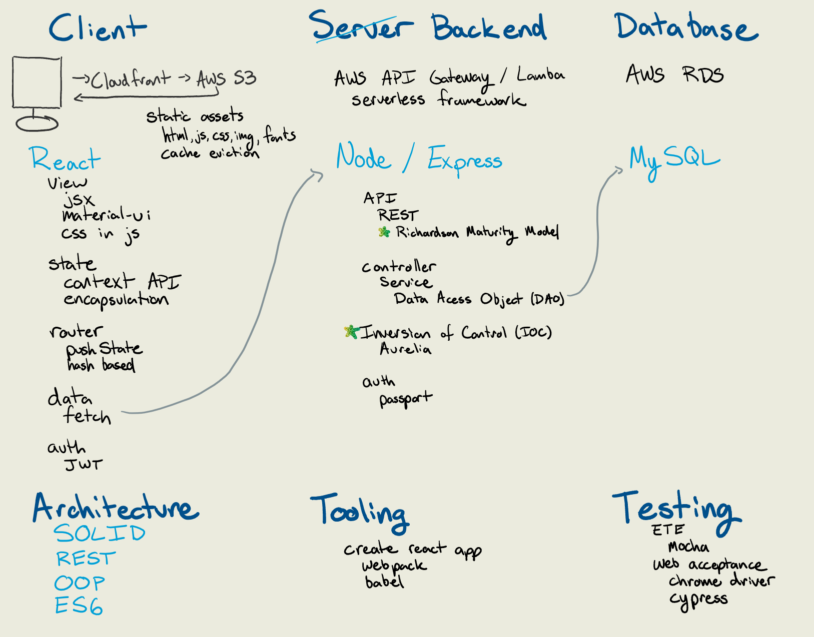

# Notes

High level outline of the frameworks, tools, and concepts in the SQL, Express, React, Node (SERN) stack



## Development Stack

* Client - SPA
  * [React](https://reactjs.org/)
    * [React DOM](https://reactjs.org/docs/react-dom.html)
    * [State](https://reactjs.org/docs/state-and-lifecycle.html)
      * ~~[redux](https://redux.js.org/basics/usage-with-react)~~
      * React State Management
        * [Context API](https://reactjs.org/docs/context.html)
        * Encapsulation
        * Props through State Tree
        * Sideload
        * Subscription
    * [React Router](https://reacttraining.com/react-router/web/guides/quick-start)
      * [`History.pushState()`](https://developer.mozilla.org/en-US/docs/Web/API/History_API)
      * [HashRouter](https://reacttraining.com/react-router/web/api/HashRouter) uses [`window.location.hash`](https://developer.mozilla.org/en-US/docs/Web/API/Window/location)
    * Views
      * [JSX](https://reactjs.org/docs/introducing-jsx.html)
      * [CSS-in-JS](https://cssinjs.org/)
        * Multi-tenant themes?
      * Library
        * [Material UI](https://material-ui.com/)
        * [Bootstrap](https://facebook.github.io/create-react-app/docs/adding-bootstrap) (CSS)
  * Authentication
    * [JSON Web Tokens](https://jwt.io/) (JWT)
  * [Fetch API](https://developer.mozilla.org/en-US/docs/Web/API/Fetch_API)
    * ~~[AXIOS](https://github.com/axios/axios)~~
    * [Polyfill](https://github.com/github/fetch)
* Server - API
  * [Node.js](https://nodejs.org/en/)
  * [Express](https://expressjs.com/)
    * Controller 
      * Service
        * Data Access Object (DAO)
          * [MySQL Driver](https://dev.mysql.com/downloads/connector/nodejs/8.0.html)
          * ~~Object Relational Mapping (ORM)~~
  * [Aurelia DI](https://aurelia.io/docs/fundamentals/dependency-injection/)
  * Authentication
    * [Passport](http://www.passportjs.org/)
* Database
  * [MySQL](https://www.mysql.com/)
  * Procs written in Javascript (not SPs)
* Testing
  * [Mocha Test Runner](https://mochajs.org/)
    * End to End (ETE) API Test
  * Web Acceptance
    * [Chrome Driver](https://sites.google.com/a/chromium.org/chromedriver/)
    * [Cypress](https://www.cypress.io/)

## Tooling

* [Create React App](https://facebook.github.io/create-react-app/) (zero config)
  * [Webpack](https://webpack.js.org/)
  * [Babel](https://babeljs.io/)

## Deployment Infrastructure

* [Amazon Web Services (AWS)](https://aws.amazon.com/)
  * Content Delivery Network (CDN)
* [CloudFront](https://aws.amazon.com/cloudfront/)
* [AWS S3](https://aws.amazon.com/s3/)
* [AWS API Gateway](https://aws.amazon.com/api-gateway/)
* [AWS Lambda](https://aws.amazon.com/lambda/)
  * [Serverless Framework](https://serverless.com/)

## Architectural Concepts

* [REST](https://www.wikiwand.com/en/Representational_state_transfer) - REpresentational State Transfer
  * Levels of Rest Compliance
  * Evolvability
  * Media Types
  * [Richardson Maturity Model](https://martinfowler.com/articles/richardsonMaturityModel.html)
    * Level 0
    * Level 1 - Resources
    * Level 2 - HTTP Verbs
    * Level 3 - Hypermedia Controls
* [Object Oriented Programing (OOP)](https://www.wikiwand.com/en/Object-oriented_programming) Concepts
  * Abstraction
  * Encapsulation
  * Inheritance
  * Polymorphism
  * Association
  * Aggregation
  * Composition
  * Delegation
  * Coupling
  * Cohesion
* Patterns
  * [Strategy Pattern](https://www.wikiwand.com/en/Strategy_pattern)
  * [Data Access Object](https://www.wikiwand.com/en/Data_access_object)
  * [Inversion of Control (IOC)](https://www.wikiwand.com/en/Inversion_of_control)
  * [Dependency Injection (DI)](https://www.wikiwand.com/en/Dependency_injection)
* [SOLID](https://www.wikiwand.com/en/SOLID)
  * Single Responsibility Principle
  * Open / Closed Principle
  * Liskov Substitution Principle
  * Interface Segregation Principle
  * Dependency Inversion Principle
* Javascript
  * [JS Cheatsheet](https://mbeaudru.github.io/modern-js-cheatsheet/)
  * [ES6](http://es6-features.org/)
    * Import > (~~require~~)
    * Promises
* Multi-tenancy

## Questions

* Typescript
* Async / Await
* IDE

---

## MySQL

### Downloads

* [MySql Full Install](https://dev.mysql.com/downloads/windows/installer/8.0.html)
  * [MySQL Community Server](https://dev.mysql.com/downloads/windows/installer/8.0.html)
  * [MySQL Workbench](https://dev.mysql.com/downloads/workbench/)

### Docs

* [MySQL Shell](https://dev.mysql.com/doc/mysql-shell/8.0/en/)
* [MySql Community Server 8.0](https://dev.mysql.com/doc/refman/8.0/en/)
* [MySQL Workbench](https://dev.mysql.com/doc/workbench/en/)
* [AQS RDS MySql](https://aws.amazon.com/rds/mysql/)
  * [Getting Started](https://aws.amazon.com/getting-started/tutorials/create-mysql-db/)


* [Create Database](https://dev.mysql.com/doc/refman/8.0/en/create-database.html)
  ```sql
  CREATE DATABASE dbSky;
  ```

* [Create Table](https://dev.mysql.com/doc/refman/8.0/en/create-table.html)
* [Data Types](https://dev.mysql.com/doc/refman/8.0/en/data-types.html)
  ```sql
  USE dbSky;
  CREATE TABLE posts ( 
    id smallint unsigned not null auto_increment,
    text varchar(280) not null, 
    constraint pk_posts primary key (id)
  );
  INSERT INTO posts ( id, text ) VALUES ( null, 'Sample data' );
  SELECT * FROM posts;
  ```

### Troubleshooting  

* [MySql 5.7 installer fails to detect VS 2013 redistributable](https://stackoverflow.com/q/45163588/1366033)
* [Troubleshoot Installing MySql 8.0 and Visual C++ Redistributable on Windows](https://stackoverflow.com/q/54317796/1366033)
* [Starting MySQL from the Windows Command Line](https://dev.mysql.com/doc/refman/8.0/en/windows-start-command-line.html)
  ```bash
  cd "C:\Program Files\MySQL\MySQL Server 8.0\bin\"
  .\mysqld
  ```
* [mysqld: Can't change dir to data. Server doesn't start](https://stackoverflow.com/q/33752407/1366033)  
  ```bash
  cd "/c/Program Files/MySQL/MySQL Server 8.0/bin"
  ./mysqld --initialize
  ```
* [Only one usage of each socket address (protocol/network address/port) is normally permitted?](https://stackoverflow.com/q/41836209/1366033)
* [Who's listening on a port](https://stackoverflow.com/q/48198/1366033)
  ```bash
  netstat -a -b
  ```
* [Cannot connect to Database server (mysql workbench)](https://stackoverflow.com/a/7875732/1366033)
  ```bash
  mysql -u root -p -h 127.0.0.1 -P 3306
  ```
* [Access Denied for User 'root'@'localhost' (using password: YES)](https://stackoverflow.com/q/17975120/1366033)
* [What is the benefit of zerofill in MySQL?](https://stackoverflow.com/q/5256469/1366033)
* [MySql Console - Can't quit incorrect mySQL command line](https://stackoverflow.com/q/28098061/1366033)
